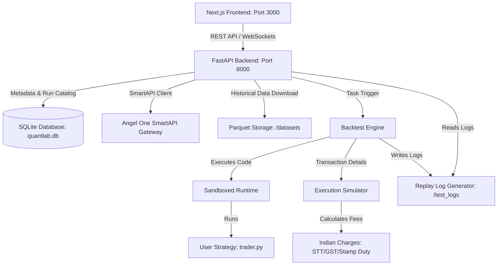

# QuantLab: Setup & Operations Guide

Welcome to **QuantLab**, a professional-grade quantitative trading research, backtesting, replay, and visualization platform designed for Indian markets. 

QuantLab integrates Angel One's **SmartAPI** (with TOTP) for historical data fetching, utilizes a high-performance **Parquet storage system** for market datasets, runs sandboxed Python strategies, simulates Indian market execution charges (STT, GST, SEBI, etc.), and visualizes backtest replays in a premium dashboard.

---

## 🏛️ System Architecture Overview

The system is organized into three major components:
1. **Frontend (Next.js client)**: A modern, reactive dashboard featuring Monaco Editor, TradingView Lightweight Charts, and ECharts visualizations.
2. **Backend (FastAPI server)**: Acts as the orchestrator, managing the authentication bridge to Angel One, SQLite database models, strategy lifecycle, and task execution.
3. **Core Engine (Python modules)**: Handles the event-driven backtesting loop, order matching logic, transaction charge calculations, and analytics engines (risk metrics, regimes, and capital optimization).



---

## 📋 Prerequisites

Ensure your system has the following installed:
* **Python 3.10+** (Virtual environment support recommended)
* **Node.js v18.0.0+**
* **NPM** (packaged with Node.js)
* **Git** (optional, for code management)

---

## 📁 Workspace Folder Structure

```text
quantp/
├── backend/            # FastAPI application (main.py, database.py, smartapi.py)
├── engine/             # Python backtest, execution, analytics, and optimization modules
├── frontend/           # Next.js 15 Client app (pages, styles, components)
├── datasets/           # Parquet-formatted historical candle storage
├── strategies/         # User strategy Python files (trader.py templates)
├── tests/              # Python automated unit tests
├── .env                # Local secrets configuration (ignored by Git)
├── .env.example.txt    # Template for environment variables
├── requirements.txt    # Python dependencies listing
└── README.md           # This setup guide
```

---

## ⚙️ Phase 1: Environment Configuration

To configure the credentials for Angel One's SmartAPI:

1. Create a copy of `.env.example.txt` and rename it to `.env` in the root workspace directory:
   ```bash
   copy .env.example.txt .env
   ```
2. Edit `.env` and fill in your developer credentials from your Angel One developer dashboard:
   ```env
   SMARTAPI_CLIENT_CODE="YOUR_CLIENT_CODE"
   SMARTAPI_PASSWORD="YOUR_PASSWORD"
   SMARTAPI_API_KEY="YOUR_API_KEY"
   ```

> [!TIP]
> **Mock Mode Fallback:** If you do not have an Angel One developer account yet, the platform automatically boots into **Mock Mode**. It generates realistic Indian market price feeds (e.g. SBIN, NIFTY) and allows you to test the entire suite client-side or server-side without API keys.

---

## 🐍 Phase 2: Backend Setup & Execution

### 1. Set Up the Virtual Environment
Create and activate a virtual environment to isolate backend dependencies.

* **On Windows (PowerShell):**
  ```powershell
  python -m venv .venv
  .venv\Scripts\Activate.ps1
  ```
* **On Windows (Command Prompt - CMD):**
  ```cmd
  python -m venv .venv
  .venv\Scripts\activate.bat
  ```
* **On Linux / macOS:**
  ```bash
  python3 -m venv .venv
  source .venv/bin/activate
  ```

### 2. Install Python Dependencies
Upgrade `pip` and install all required modules listed in [requirements.txt](file:///c:/Users/rajy7/quantp/requirements.txt):
```bash
python -m pip install --upgrade pip
pip install -r requirements.txt
```

### 3. Run the Backend FastAPI Server
Start the Uvicorn production-ready server from the workspace root directory using the virtual environment's Python (this resolves the dependencies and module path automatically):

* **On Windows (PowerShell or Command Prompt):**
  ```powershell
  .venv\Scripts\python -m backend.main
  ```
* **On Linux / macOS:**
  ```bash
  .venv/bin/python -m backend.main
  ```

> [!NOTE]
> Running the python file directly (e.g. `python backend/main.py`) will cause import errors because Python will not look for the root `backend` package. Running with `-m backend.main` using the virtual environment's Python executes it as a module and resolves this.


The server starts by executing the initialization steps, building the tables inside the SQLite file `quantlab.db`, and listening on port `8000`:
```text
INFO: Initializing Database...
INFO: Database Initialization Complete.
--- QuantLab Backend Starting on http://0.0.0.0:8000 ---
INFO:     Started server process [2345]
INFO:     Waiting for application startup.
INFO:     Application startup complete.
INFO:     Uvicorn running on http://0.0.0.0:8000 (Press CTRL+C to quit)
```

> [!IMPORTANT]
> The backend server must remain running for the frontend dashboard to access databases, historical data, and run server-side backtesting.

---

## ⚛️ Phase 3: Frontend Setup & Execution

1. Navigate to the frontend directory:
   ```bash
   cd frontend
   ```
2. Install the frontend dependencies (Next.js, Tailwind, Lightweight Charts, ECharts, Monaco Editor, Lucide):
   ```bash
   npm install
   ```
3. Run the Next.js development server:
   ```bash
   npm run dev
   ```
4. Open your web browser and navigate to:
   ```text
   http://localhost:3000
   ```

---

## 🧪 Phase 4: Running Automated Tests

To ensure the execution calculations, sandboxing restrictions, and backtester matching systems are operating correctly:

1. Ensure your virtual environment is active.
2. Run the Python test suite from the root directory:
   ```bash
   pytest tests/
   ```
   Or run the test script directly:
   ```bash
   python tests/test_backtest.py
   ```

Expected output:
```text
All tests passed successfully!
```

---

## 🛠️ Step-by-Step Operations Walkthrough

Once both servers are running, follow these steps to run your first backtest:

### 📥 Step 1: Download Historical Market Data
1. Open the dashboard at `http://localhost:3000` and go to **Dataset Explorer** in the sidebar.
2. Enter the symbol (e.g. `SBIN`), interval (e.g. `ONE_MINUTE` or `FIVE_MINUTE`), and a date range.
3. Click **Download Dataset**. 
4. The backend downloads the candles, indexes them, and saves them locally as a `.parquet` file in `/datasets`.

### ✍️ Step 2: Develop a Trading Strategy
1. Click **Strategy IDE** in the sidebar.
2. You will see a fullscreen Monaco editor pre-loaded with an **EMA Crossover Template**.
3. Customize the parameters (e.g., fast EMA period, slow EMA period) or rewrite the `on_bar` logic.
4. Click **Save Strategy** to store the script in the database.

### 🚀 Step 3: Run the Backtest Simulation
1. Set the initial capital (e.g. `100,000` INR) and slippage settings.
2. Choose your downloaded dataset.
3. Click **Run Backtest**. The backend parses your script in a sandboxed runtime, steps candle-by-candle, executes orders while factoring in Indian Brokerage, STT, and Stamp Duty, and creates log files.

### 📊 Step 4: Replay & Visual Analytics
1. Navigate to **Replay Studio**. Use the controls to play, pause, step forward, or adjust speed (up to 10x). Watch the charts, indicators, and trade markers align.
2. Open **Research Lab** to view performance attribution maps showing how your strategy handles different market regimes (trending bullish vs ranging volatile).
3. Visit **Capital Studio** to view the minimum capital requirements curve and ensure your risk of ruin is minimized.
4. Open the **Optimization Lab** to search parameter combinations and find the highest Sharpe ratios.

---

## ⚠️ Troubleshooting Guide

### 1. PowerShell Script Execution Policy
* **Symptom**: Trying to run `.venv\Scripts\Activate.ps1` gives a script execution error.
* **Solution**: Run the following command in PowerShell with administrator privileges to allow execution:
  ```powershell
  Set-ExecutionPolicy -ExecutionPolicy RemoteSigned -Scope CurrentUser
  ```

### 2. CORS or Backend Offline Errors
* **Symptom**: The frontend header shows "Backend Offline" and buttons are inactive.
* **Solution**: Ensure that `python -m backend.main` is running in your terminal on `http://127.0.0.1:8000`. If you use custom ports, set the `BACKEND_PORT` environment variable or adjust `API_BASE` in [page.tsx](file:///c:/Users/rajy7/quantp/frontend/src/app/page.tsx#L15).

### 3. Missing Dataset / Candle Errors
* **Symptom**: Running a backtest displays a "Parquet dataset not found" error.
* **Solution**: Go to the **Dataset Explorer** tab and download data for the symbol first, or configure SmartAPI credentials if the mock data ranges do not cover your target backtest dates.
