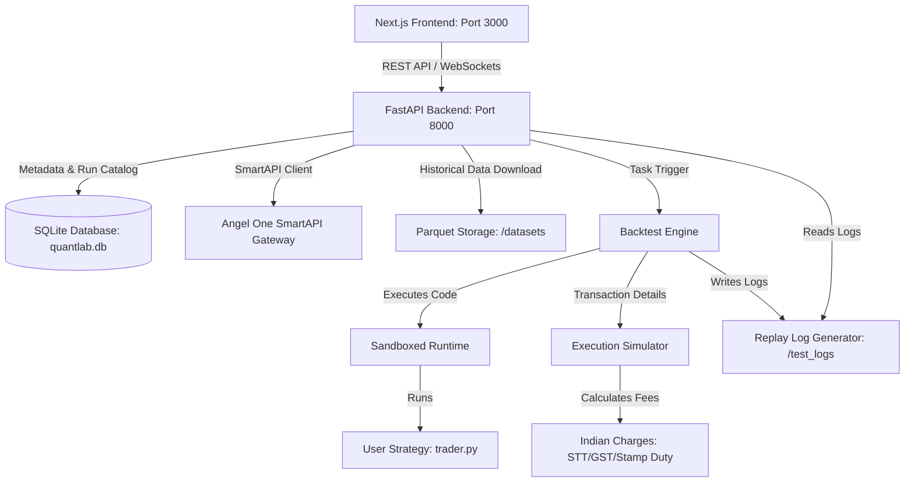

# QuantLab

<p align="center">
  
  
  
  
  
</p>

> **Professional-grade quantitative trading research, backtesting, replay, and visualization platform designed for Indian markets.**

QuantLab integrates **Angel One SmartAPI** (with TOTP) for real historical data, runs sandboxed Python strategies, simulates **Indian market execution charges** (STT, GST, SEBI, Stamp Duty), and visualizes everything in a premium Next.js dashboard with **TradingView Lightweight Charts**, **ECharts**, and **Monaco Editor**.

---

## ✨ Features

| Feature | Description |
|---------|-------------|
| 🏠 **Dashboard** | System health, connection status, quick backtest launch, and live notifications |
| 📥 **Datasets** | Download real historical candles from SmartAPI, preview with interactive charts, manage CSV/Parquet/Excel storage |
| 📝 **Strategy Workspace** | Monaco Editor with Python templates, symbol/interval/capital configuration, risk settings, and parameter JSON |
| 🚀 **Backtests & Replay** | Event-driven engine with Indian charge simulation, equity/drawdown charts, per-symbol analytics, and frame-by-frame replay studio |
| 📡 **Live Trading (Mock)** | Real-time market data, manual order placement, live PnL tracking, full charge breakdown, and SSE event streaming |
| 🛰️ **Deployments** | Paper and live deployment management with status monitoring and event history |
| 🔬 **Research Lab** | Deep statistical analysis — returns, volatility, regime detection, seasonality, and strategy suitability scoring |
| 🔗 **Multi-Asset Research** | Correlation matrices, pair discovery, cointegration, spread analysis, lead-lag, and sector breadth |
| ⚡ **Portfolio Risk** | Monte Carlo simulation, stress testing, risk-of-ruin, drawdown projections, and confidence intervals |
| 🎯 **Optimization Lab** | Grid/random search with Sharpe/Sortino/Calmar objectives, walk-forward validation, and 3D surface plots |
| 🧹 **System Cleanup** | Log and dataset cleanup, database vacuum, and disk usage analytics |

> **Real Data Only:** The platform enforces real downloaded candles for all production backtests. No simulated or mock data is injected into the backtest engine.

---

## 📸 Screenshots & UI Highlights

All screenshots were captured live from the running application on `localhost:3000` via Kimi WebBridge.

### 🏠 Dashboard


### 📥 Datasets — Real Historical Data Catalog


### 📝 Strategy Workspace — Monaco Editor & Configuration


### 🚀 Backtest Simulation Engine


### 📡 Live Mock Trading (Paper Mode)


### 🔬 Research Lab — Statistical Diagnostics


### 🔗 Multi-Asset Research — Correlation & Pair Analysis


### ⚡ Portfolio Risk — Monte Carlo Simulation


### 🎯 Optimizer — Grid Search Parameter Sweeps


### 🧹 System Cleanup — Disk & Database Maintenance


---

## 🏛️ System Architecture



### Tech Stack

| Layer | Technology |
|-------|------------|
| **Frontend** | Next.js 15, React, Tailwind CSS, TypeScript, Monaco Editor, TradingView Lightweight Charts, ECharts, Lucide Icons |
| **Backend** | FastAPI, Uvicorn, SQLAlchemy, SQLite, Pydantic, WebSockets, SSE |
| **Engine** | Python 3.10+, NumPy, Pandas, Parquet, sandboxed exec, event-driven loop |
| **Data** | Angel One SmartAPI, TOTP 2FA, CSV/Parquet/Excel storage, Redis (optional) |
| **AI/LLM** | Ollama integration for strategy assistance and research summarization |

---

## 📁 Folder Structure

```
quantp/
├── backend/            # FastAPI application (main.py, database.py, smartapi.py, routers/)
│   ├── routers/        # API endpoints: auth, backtest, data, deployments, groups, live_trading, research, strategies
│   └── services/       # Data service, market data service, SmartAPI manager, Redis, Ollama
├── engine/             # Core backtest, execution, analytics, and optimization modules
│   ├── runtime/        # Sandboxed strategy execution, adapters, datamodels
│   ├── analytics.py    # Risk metrics and performance attribution
│   ├── backtester.py   # Event-driven backtesting loop
│   ├── execution.py    # Order matching and charge calculation
│   ├── market.py       # Market data interface and regime detection
│   ├── monte_carlo.py  # Portfolio simulation
│   ├── optimization.py # Parameter search and walk-forward analysis
│   ├── portfolio.py    # Portfolio tracking and sizing
│   ├── regime.py       # Market regime classification
│   ├── research.py     # Statistical research tools
│   ├── research_multiasset.py  # Multi-asset correlation and cointegration
│   ├── replay_logger.py        # Replay log generation
│   └── walk_forward.py       # Walk-forward optimization
├── frontend/           # Next.js 15 client app
│   ├── src/app/        # Pages, hooks, and layout
│   ├── src/components/ # React components: ResearchLab, MultiAssetResearch, PortfolioAnalytics, charts
│   └── public/         # Static assets
├── datasets/           # Parquet/CSV/Excel historical candle storage
│   ├── csv/            # Symbol-named CSV files
│   ├── parquet/        # Efficient columnar storage
│   ├── excel/          # Excel exports
│   ├── catalog.json    # Dataset metadata index
│   ├── groups.yaml     # Symbol grouping definitions
│   └── symbol_tokens.json  # SmartAPI token mapping
├── strategies/         # User strategy Python files and templates
├── tests/              # Python unit tests and backtest verification scripts
├── logs/               # Backtest replay logs (JSONL format)
├── .env                # Local secrets (ignored by Git)
├── .env.example.txt    # Environment variable template
├── requirements.txt    # Python dependencies
├── quantlab.db         # SQLite database (auto-created)
└── README.md           # This file
```

---

## 📋 Prerequisites

Ensure your system has the following installed:

- **Python 3.10+** (Virtual environment support recommended)
- **Node.js v18.0.0+**
- **NPM** (packaged with Node.js)
- **Git** (optional, for code management)

---

## ⚙️ Installation & Setup

### 1. Environment Configuration

To configure credentials for Angel One's SmartAPI:

1. Create a copy of `.env.example.txt` and rename it to `.env` in the root workspace directory:
   ```bash
   copy .env.example.txt .env
   ```
2. Edit `.env` and fill in your developer credentials from your Angel One developer dashboard:
   ```env
   SMARTAPI_CLIENT_CODE="YOUR_CLIENT_CODE"
   SMARTAPI_PASSWORD="YOUR_PASSWORD"
   SMARTAPI_API_KEY="YOUR_API_KEY"
   ```

> [!TIP]
> **Mock Mode Fallback:** If you do not have an Angel One developer account yet, the platform automatically boots into **Mock Mode**. It generates realistic Indian market price feeds (e.g., SBIN, NIFTY) and allows you to test the entire suite client-side or server-side without API keys.

---

### 2. Backend Setup & Execution

#### Set Up the Virtual Environment

Create and activate a virtual environment to isolate backend dependencies.

**On Windows (PowerShell):**
```powershell
python -m venv .venv
.venv\Scripts\Activate.ps1
```

**On Windows (Command Prompt - CMD):**
```cmd
python -m venv .venv
.venv\Scripts\activate.bat
```

**On Linux / macOS:**
```bash
python3 -m venv .venv
source .venv/bin/activate
```

#### Install Python Dependencies

Upgrade `pip` and install all required modules listed in [requirements.txt](requirements.txt):
```bash
python -m pip install --upgrade pip
pip install -r requirements.txt
```

#### Run the Backend FastAPI Server

Start the Uvicorn production-ready server from the workspace root directory using the virtual environment's Python (this resolves the dependencies and module path automatically):

**On Windows (PowerShell or Command Prompt):**
```powershell
.venv\Scripts\python -m backend.main
```

**On Linux / macOS:**
```bash
.venv/bin/python -m backend.main
```

> [!NOTE]
> Running the python file directly (e.g., `python backend/main.py`) will cause import errors because Python will not look for the root `backend` package. Running with `-m backend.main` using the virtual environment's Python executes it as a module and resolves this.

The server starts by executing the initialization steps, building the tables inside the SQLite file `quantlab.db`, and listening on port `8000`:
```text
INFO: Initializing Database...
INFO: Database Initialization Complete.
--- QuantLab Backend Starting on http://0.0.0.0:8000 ---
INFO:     Started server process [2345]
INFO:     Waiting for application startup.
INFO:     Application startup complete.
INFO:     Uvicorn running on http://0.0.0.0:8000 (Press CTRL+C to quit)
```

> [!IMPORTANT]
> The backend server must remain running for the frontend dashboard to access databases, historical data, and run server-side backtesting.

---

### 3. Frontend Setup & Execution

1. Navigate to the frontend directory:
   ```bash
   cd frontend
   ```
2. Install the frontend dependencies (Next.js, Tailwind, Lightweight Charts, ECharts, Monaco Editor, Lucide):
   ```bash
   npm install
   ```
3. Run the Next.js development server:
   ```bash
   npm run dev
   ```
4. Open your web browser and navigate to:
   ```
   http://localhost:3000
   ```

---

### 4. Running Automated Tests

To ensure the execution calculations, sandboxing restrictions, and backtester matching systems are operating correctly:

1. Ensure your virtual environment is active.
2. Run the Python test suite from the root directory:
   ```bash
   pytest tests/
   ```
   Or run the test script directly:
   ```bash
   python tests/test_backtest.py
   ```

Expected output:
```text
All tests passed successfully!
```

---

## 🛠️ Step-by-Step Operations Walkthrough

Once both servers are running, follow these steps to run your first backtest:

### 📥 Step 1: Download Historical Market Data
1. Open the dashboard at `http://localhost:3000` and go to **Datasets** in the sidebar.
2. Enter the symbol (e.g., `SBIN`), interval (e.g., `ONE_MINUTE` or `FIVE_MINUTE`), and a date range.
3. Click **Download Dataset**.
4. The backend downloads the candles, indexes them, and saves them locally in `/datasets/csv` and `/datasets/parquet`.
5. Click **Preview** to view the interactive candlestick chart before using the data.

### ✍️ Step 2: Develop a Trading Strategy
1. Click **Strategy Workspace** in the sidebar.
2. You will see a fullscreen Monaco editor pre-loaded with an **EMA Crossover Template**.
3. Customize the parameters (e.g., fast EMA period, slow EMA period) or rewrite the `on_bar` logic.
4. Configure symbols, interval, capital, max position, and risk settings.
5. Click **Save Strategy** to store the script in the database.

### 🚀 Step 3: Run the Backtest Simulation
1. Go to the **Backtests** tab.
2. Select your saved strategy, set the date range, and configure slippage.
3. Choose **Trade Type** (`INTRADAY` or `DELIVERY`) and position sizing.
4. Click **Run Backtest**. The backend parses your script in a sandboxed runtime, steps candle-by-candle, executes orders while factoring in Indian Brokerage, STT, and Stamp Duty, and creates log files.

### 📊 Step 4: Replay & Visual Analytics
1. In the **Backtests** tab, select a completed run and open the **Replay Studio**.
2. Use the controls to play, pause, step forward, or adjust speed (up to 10x). Watch the charts, indicators, and trade markers align.
3. Open the **Research Lab** to view performance attribution maps showing how your strategy handles different market regimes (trending bullish vs. ranging volatile).
4. Visit **Portfolio Risk** to view Monte Carlo simulations and stress-test your portfolio.
5. Open the **Optimization Lab** to search parameter combinations and find the highest Sharpe ratios with walk-forward validation.

---

## 📖 Documentation

- **[User Manual](USER_MANUAL.md)** — Complete feature guide, tab-by-tab walkthrough, and troubleshooting
- **[Implementation Plan](implementation_plan.md)** — Technical architecture and development roadmap
- **[Multi-Symbol Backtest Guide](strategies/MULTI_SYMBOL_BACKTEST_GUIDE.md)** — Guide for running multi-asset strategies

---

## ⚠️ Troubleshooting Guide

### 1. PowerShell Script Execution Policy
- **Symptom**: Trying to run `.venv\Scripts\Activate.ps1` gives a script execution error.
- **Solution**: Run the following command in PowerShell with administrator privileges to allow execution:
  ```powershell
  Set-ExecutionPolicy -ExecutionPolicy RemoteSigned -Scope CurrentUser
  ```

### 2. CORS or Backend Offline Errors
- **Symptom**: The frontend header shows "Backend Offline" and buttons are inactive.
- **Solution**: Ensure that `python -m backend.main` is running in your terminal on `http://127.0.0.1:8000`. If you use custom ports, set the `BACKEND_PORT` environment variable or adjust `API_BASE` in `frontend/src/app/page.tsx`.

### 3. Missing Dataset / Candle Errors
- **Symptom**: Running a backtest displays a "Dataset not found" error.
- **Solution**: Go to the **Datasets** tab and download data for the symbol first, or configure SmartAPI credentials if the mock data ranges do not cover your target backtest dates.

### 4. Strategy Sandbox Error
- **Symptom**: Backtest fails with "Sandbox execution error".
- **Solution**: Check your Python syntax in the Monaco Editor. Ensure your `on_bar` function signature matches the template (`def on_bar(bar, state, context):`).

---

## 🤝 Contributing

Contributions are welcome! Please open an issue or submit a pull request for:

- New strategy templates
- Additional chart types or visualizations
- New research and analytics modules
- Bug fixes and performance improvements
- Documentation improvements

---

## 📜 License

This project is open-source and available for personal and research use. Please check the repository for the full license text.

---

<p align="center">
  <b>Built for Indian markets. Powered by real data. No shortcuts.</b>
</p>

<p align="center">
  🚀 <b>Happy backtesting!</b> 🚀
</p>
