# QuantLab

<p align="center">
  
  
  
  
  
  
</p>

**QuantLab** is a professional-grade quantitative trading platform built for Indian **equity** markets. It connects to **Angel One SmartAPI** for real historical data, runs sandboxed Python strategies, simulates real Indian market charges (STT, GST, SEBI, Stamp Duty), and visualizes everything through a premium Next.js dashboard with TradingView Lightweight Charts, ECharts, and the Monaco Editor.

> **Scope: equities only.** QuantLab trades cash equities (NSE/BSE delivery and intraday). Options, futures, and the Dhan HQ pipeline have been removed — there is no options strategy builder, no F&O bhavcopy import, and no Dhan integration. Every feature below operates on equity candles.

---

## Features

| Feature | Description |
|---------|-------------|
| **Dashboard** | System health, connection status, quick backtest launch, and live notifications |
| **Datasets** | Download real historical equity candles from SmartAPI with From/To date range filtering, async background jobs with progress tracking, universal data aggregator (chunking, merge, dedup, forward-fill), preview with interactive charts, file export (CSV/Excel/Parquet), and symbol group / basket management |
| **Strategy Workspace** | Monaco Editor with Python templates, dual runtime support (`legacy_on_bar` / `prosperity_trader`), symbol/interval/capital configuration, auto max-position sizing from volatility, risk settings, and parameter JSON |
| **Backtests & Replay** | Event-driven engine with Indian charge simulation, equity/drawdown charts, per-symbol analytics, auto max-position sizing, data coverage validation, and frame-by-frame replay studio with speed controls |
| **Live Trading (Mock)** | Dedicated `/live` trading page with real-time market data, manual order placement, live PnL tracking, full charge breakdown, SSE event streaming, pause/resume deployments, reset capital, and deployment event logs |
| **Deployments** | Paper and live deployment management with status monitoring, pause/resume, capital reset, PnL snapshots, event history, and service-oriented orchestration |
| **Research Lab** | Deep statistical analysis — returns, volatility, regime detection (HMM), seasonality, strategy-suitability scoring, mean-reversion diagnostics (Hurst, half-life), gap analysis, intraday behavior, volatility structure, tail risk, order-flow proxies, multi-timeframe analysis, factor exposure, walk-forward stability, feature-importance engine, and AI strategy generator |
| **Multi-Asset Research** | Correlation matrices, pair discovery, cointegration, spread analysis, lead-lag, sector breadth, rolling correlation, and cross-sectional factor ranking with From/To date range filtering |
| **Portfolio Risk** | Monte Carlo simulation, stress testing, risk-of-ruin, drawdown projections, confidence intervals, and daily PnL heatmaps |
| **Optimization Lab** | Grid/random search with Sharpe/Sortino/Calmar objectives, walk-forward validation, sensitivity analysis, and 3D surface plots |
| **Strategy Registry** | Backend market-analysis pipeline that auto-ranks strategies by suitability, runs walk-forward optimization with robustness scoring, overfit detection, and grading profiles |
| **System Cleanup** | Log and dataset cleanup, database vacuum, and disk usage analytics |

> **Real Data Only.** The platform enforces real downloaded candles for all production backtests. No simulated or mock data is injected into the backtest engine.

---

## Dual Runtime Engine

QuantLab supports two strategy execution models side by side. You pick one per strategy:

| Runtime | Signature | Returns | Best For |
|---------|-----------|---------|----------|
| **legacy_on_bar** | `def on_bar(self, state)` | `list[dict]` | Quick backtests, single/multi-symbol, candle-based signals |
| **prosperity_trader** | `def run(self, state)` | `(orders, conversions, trader_data)` | Order-book-aware strategies, live trading, state persistence |

Both runtimes are sandboxed, charge-aware, and replay-compatible. The engine auto-detects your runtime from the strategy class and selects the correct adapter. See the sample files for a working EMA crossover in each style.

---

## Trade Types

Backtests and live trades support two equity trade modes:

- **INTRADAY** — squared off within the session; uses a 5× intraday margin multiplier and intraday brokerage.
- **DELIVERY** — carried overnight; full capital margin and delivery brokerage.

Options and futures are not supported.

---

## Symbol Format

All symbols are automatically normalized to the canonical `NSE:SYMBOL-EQ` format across the entire stack:

- **Frontend** — type `SBIN`, it becomes `NSE:SBIN-EQ` before sending
- **Backend** — stored as `NSE:SBIN-EQ` in the database
- **Engine** — catalog lookups, backtests, and live data all use the canonical form

You never need to think about it. Just type the symbol name and everything resolves correctly.

---

## Screenshots

All screenshots were captured live from the running application on `localhost:3000`.

**Dashboard**
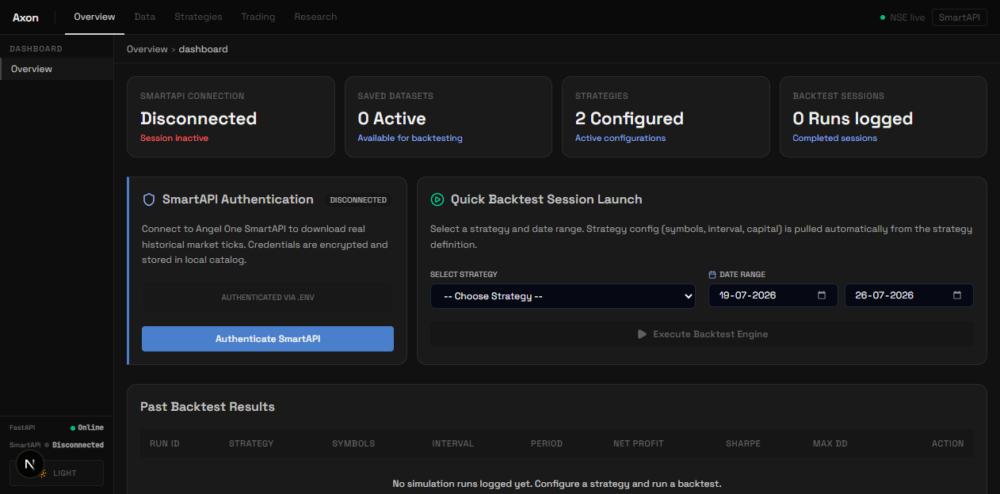

**Datasets — Real Historical Data Catalog**
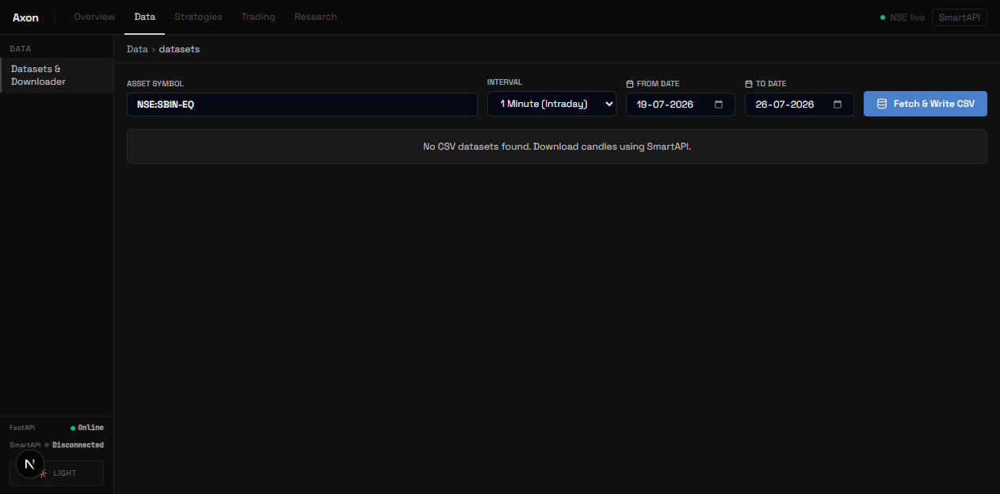

**Strategy Workspace — Monaco Editor & Configuration**
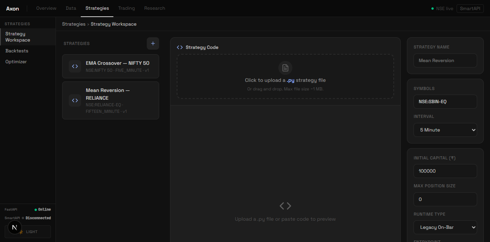

**Backtest Simulation Engine**
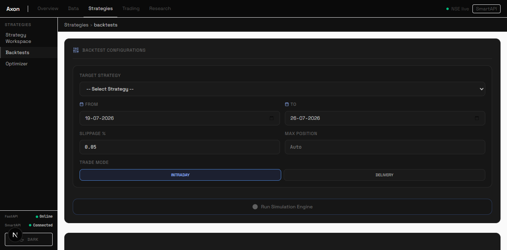

**Optimizer — Grid Search Parameter Sweeps**
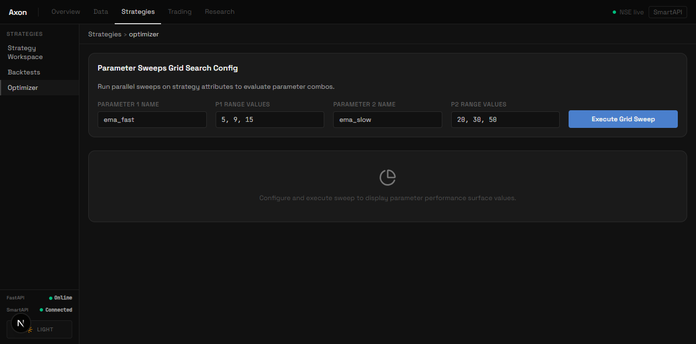

**Deployments — Paper / Live Management**
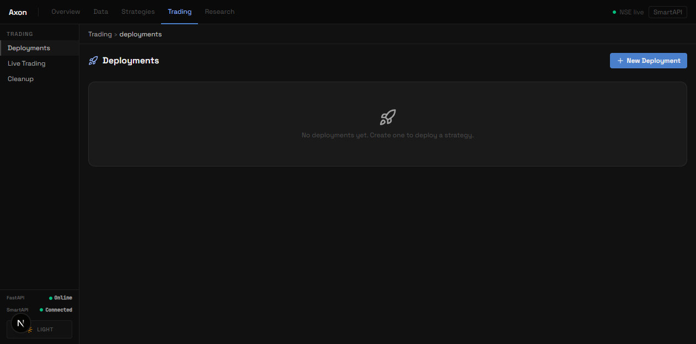

**Live Mock Trading (Paper Mode)**
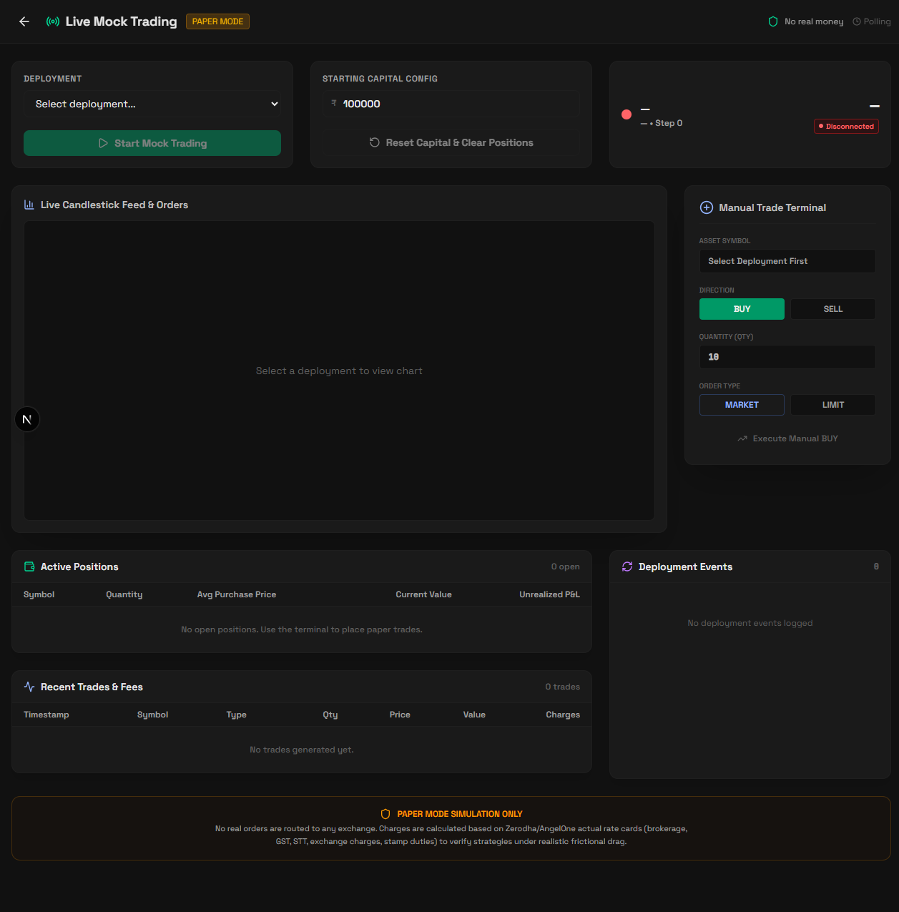

**System Cleanup — Disk & Database Maintenance**
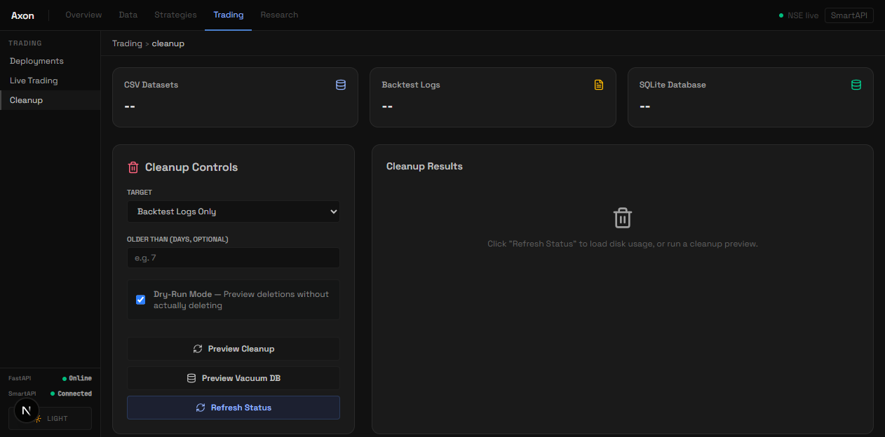

**Research Lab — Statistical Diagnostics**
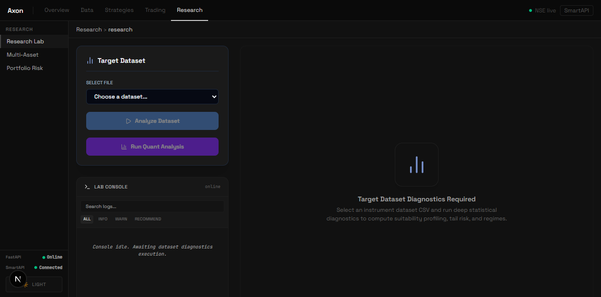

**Multi-Asset Research — Correlation & Pair Analysis**
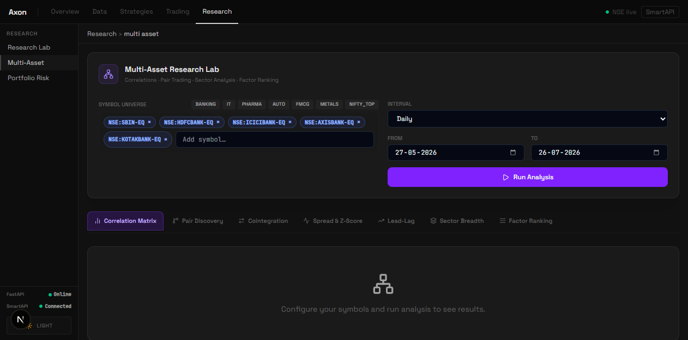

**Portfolio Risk — Monte Carlo Simulation**
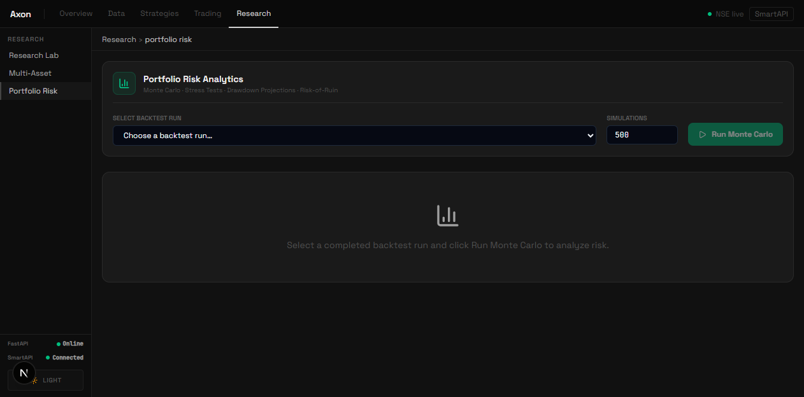

---

## System Architecture

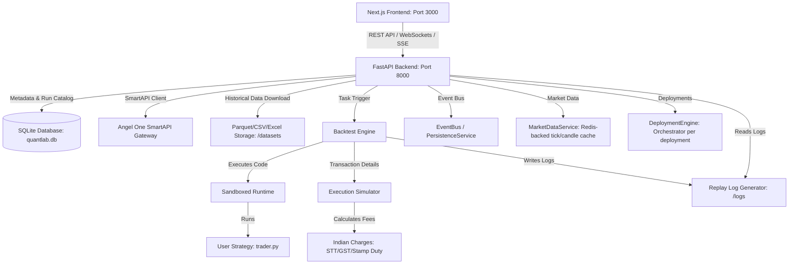
```mermaid
graph TD
    A[Next.js Frontend: Port 3000] -->|REST API / WebSockets / SSE| B[FastAPI Backend: Port 8000]
    B -->|Metadata & Run Catalog| C[(SQLite Database: quantlab.db)]
    B -->|SmartAPI Client| D[Angel One SmartAPI Gateway]
    B -->|Historical Data Download| E[Parquet/CSV/Excel Storage: /datasets]
    B -->|Task Trigger| F[Backtest Engine]
    F -->|Executes Code| G[Sandboxed Runtime]
    G -->|Runs| H[User Strategy: trader.py]
    F -->|Transaction Details| I[Execution Simulator]
    I -->|Calculates Fees| J[Indian Charges: STT/GST/Stamp Duty]
    F -->|Writes Logs| K[Replay Log Generator: /logs]
    B -->|Reads Logs| K
    B -->|Event Bus| N[EventBus / PersistenceService]
    B -->|Market Data| O[MarketDataService: Redis-backed tick/candle cache]
    B -->|Deployments| P[DeploymentEngine: Orchestrator per deployment]
```

### Tech Stack

| Layer | Technology |
|-------|------------|
| **Frontend** | Next.js 16, React 19, Tailwind CSS v4, TypeScript, Monaco Editor, TradingView Lightweight Charts, ECharts, Lucide Icons |
| **Backend** | FastAPI, Uvicorn, SQLAlchemy, SQLite (WAL mode), Pydantic, WebSockets, SSE, async background jobs, APScheduler |
| **Engine** | Python 3.10+, NumPy, Pandas, Parquet, sandboxed exec, event-driven loop, universal data aggregator |
| **Data** | Angel One SmartAPI, TOTP 2FA, CSV/Parquet/Excel storage, Redis-backed tick/candle cache |
| **AI/LLM** | Ollama integration for strategy assistance, research summarization, and AI strategy generation |

---

## Folder Structure

```
quantp/
├── backend/                      # FastAPI application
│   ├── main.py                   # App entrypoint, lifespan management, router inclusion
│   ├── database.py               # SQLAlchemy models: StrategyDB, DeploymentDB, BacktestResultDB, DownloadJobDB, etc.
│   ├── smartapi.py               # SmartAPI client wrapper with TOTP 2FA
│   ├── data_loader.py            # Data loading utilities
│   ├── cleanup_api.py            # Cleanup router (logs, datasets, DB vacuum)
│   ├── routers/                  # API endpoint modules
│   │   ├── __init__.py           # Router aggregation for clean imports
│   │   ├── auth.py               # SmartAPI authentication, TOTP
│   │   ├── data.py               # Dataset download, catalog, search, preview
│   │   ├── strategies.py         # Strategy CRUD
│   │   ├── backtest.py           # Backtest execution, results, replay logs
│   │   ├── research.py           # Research lab, regime, capital analysis, optimization
│   │   ├── deployments.py        # Deployment lifecycle management
│   │   ├── live_trading.py       # Live mock trading, SSE streaming, manual orders
│   │   └── groups.py             # Symbol group / basket management
│   └── services/                 # Core backend services
│       ├── data_aggregator.py    # Universal data aggregator (chunk, merge, dedup, fill)
│       ├── data_service.py       # Data service layer
│       ├── download_job_service.py # Async download job tracking
│       ├── market_data_service.py  # Redis-backed tick/candle cache
│       ├── market_feed.py        # Market feed handler
│       ├── smartapi_manager.py   # SmartAPI connection manager
│       ├── redis_client.py       # Redis connection wrapper
│       ├── shared_cache.py       # In-memory shared cache
│       ├── event_bus.py          # Pub/sub event bus for deployments
│       ├── persistence_service.py  # Periodic state persistence
│       ├── deployment_engine.py    # Central deployment orchestrator manager
│       ├── deployment_orchestrator.py # Per-deployment orchestrator
│       ├── mock_deployment_engine.py  # Legacy mock engine (backwards compat)
│       ├── sizing_service.py     # Auto position sizing from volatility
│       ├── ollama_manager.py     # Ollama LLM integration
│       └── pnl_snapshot_scheduler.py   # PnL snapshot scheduling
│
├── engine/                       # Core backtest, execution, analytics, and optimization modules
│   ├── backtester.py             # Event-driven backtesting loop
│   ├── execution.py              # Order matching and charge calculation (INTRADAY / DELIVERY)
│   ├── execution_engine.py       # Order execution engine
│   ├── analytics.py              # Risk metrics and performance attribution
│   ├── portfolio.py              # Portfolio tracking and sizing
│   ├── sizing.py                 # Position sizing logic
│   ├── capital.py                # Capital requirements analysis
│   ├── order_manager.py          # Order lifecycle management
│   ├── datamodels.py             # Core data models
│   ├── market.py                 # Market data interface and regime detection
│   ├── market_interface.py       # Unified market data interface
│   ├── regime.py                 # Market regime classification
│   ├── quant_analysis.py         # Full quantitative analysis engine
│   ├── data_analyzer.py          # Deep independent dataset statistical analysis
│   ├── research.py               # Statistical research tools
│   ├── research_extras.py        # Seasonality, volume profile, S/R detection
│   ├── research_multiasset.py    # Multi-asset correlation and cointegration
│   ├── monte_carlo.py            # Portfolio simulation
│   ├── optimization.py           # Parameter search and walk-forward analysis
│   ├── walk_forward.py           # Walk-forward optimization
│   ├── replay_logger.py          # Replay log generation
│   ├── runtime/                  # Sandboxed strategy execution
│   │   ├── __init__.py
│   │   ├── sandbox.py            # Sandboxed exec environment
│   │   ├── adapters.py           # Runtime adapters (legacy / prosperity)
│   │   ├── runtimes.py           # Runtime implementations
│   │   ├── datamodels.py         # Runtime data models (Order, State, etc.)
│   │   ├── strategies.py         # Strategy base classes
│   │   └── multi_asset_strategy.py # Multi-asset strategy support
│   └── strategy_executor.py      # Strategy execution wrapper
│
├── frontend/                     # Next.js 16 client app
│   ├── src/app/
│   │   ├── page.tsx              # Main layout with tab router, top nav, sidebar
│   │   ├── layout.tsx            # Root layout
│   │   ├── globals.css           # Global styles + Tailwind v4
│   │   ├── live/page.tsx         # Dedicated live trading page
│   │   ├── hooks/
│   │   │   └── useAxon.ts        # Central state management hook
│   │   ├── components/
│   │   │   ├── DailyPnLHeatmap.tsx     # Daily PnL heatmap visualization
│   │   │   ├── shared/
│   │   │   │   └── AxonSidebar.tsx     # Main sidebar navigation (single-section mapping)
│   │   │   ├── ResearchLab.tsx          # Deep statistical research panel
│   │   │   ├── MultiAssetResearch.tsx   # Correlation / pair analysis
│   │   │   ├── PortfolioAnalytics.tsx   # Monte Carlo / risk analytics
│   │   │   ├── LightweightChart.tsx      # TradingView chart wrapper
│   │   │   ├── PnLChart.tsx              # PnL visualization
│   │   │   ├── PositionChart.tsx         # Position tracking chart
│   │   │   └── tabs/
│   │   │       ├── DashboardTab.tsx      # Dashboard + TOTP modal + error banners
│   │   │       ├── DatasetsTab.tsx       # Dataset management, download, preview
│   │   │       ├── StrategiesTab.tsx     # Strategy workspace with Monaco
│   │   │       ├── BacktestsTab.tsx      # Backtest config, results, replay
│   │   │       ├── DeploymentsTab.tsx    # Deployment list and controls
│   │   │       ├── OptimizerTab.tsx      # Grid/random search UI
│   │   │       ├── LiveTradingTab.tsx    # Live mock trading UI
│   │   │       └── CleanupTab.tsx        # Disk / DB cleanup
│   │   ├── lib/
│   │   │   └── api-client.ts             # Frontend API client
│   │   └── public/                       # Static assets
│
├── datasets/                     # Historical candle storage
│   ├── csv/                      # Symbol-named CSV files
│   ├── parquet/                  # Efficient columnar storage
│   ├── excel/                    # Excel exports
│   ├── catalog.json              # Dataset metadata index
│   ├── groups.yaml               # Symbol grouping definitions
│   └── symbol_tokens.json        # SmartAPI token mapping
│
├── docs/                         # Documentation and extra samples
│   ├── screenshots/              # UI screenshots (live captures)
│   ├── sample_strategy_legacy.py # EMA crossover sample
│   ├── sample_strategy_prosperity.py # Prosperity-style sample
│   └── test_live_trading.py      # Live trading test script
│
├── logs/                         # Backtest replay logs (JSONL)
│
├── strategies/                   # Saved strategy configs
│
├── sample_strategy_legacy.py     # EMA crossover — legacy_on_bar runtime
├── sample_strategy_prosperity.py # EMA crossover — prosperity_trader runtime
├── test_aggregator.py            # Data aggregator unit test
├── test_live_trading.py          # Live trading integration test
├── requirements.txt              # Python dependencies
├── .env.example                  # Environment variable template
├── .env                          # Local secrets (ignored by Git)
├── quantlab.db                   # SQLite database (auto-created, WAL mode)
└── README.md                     # This file
```

---

## Prerequisites

- **Python 3.10+**
- **Node.js v18.0.0+**
- **NPM** (packaged with Node.js)
- **Git** (optional)
- **Redis** (optional — falls back to in-memory caching)

---

## Installation & Setup

### 1. Environment Configuration

Create a copy of `.env.example` and rename it to `.env`:

```bash
copy .env.example .env        # Windows
cp .env.example .env          # Linux / macOS
```

Fill in your Angel One SmartAPI credentials:

```env
SMARTAPI_CLIENT_CODE="YOUR_CLIENT_CODE"
SMARTAPI_PASSWORD="YOUR_PASSWORD"
SMARTAPI_API_KEY="YOUR_API_KEY"

# Optional: network identifiers for SmartAPI headers
# SMARTAPI_CLIENT_LOCAL_IP=127.0.0.1
# SMARTAPI_CLIENT_PUBLIC_IP=127.0.0.1
# SMARTAPI_MAC_ADDRESS=00:00:00:00:00:00

# Optional: Redis
# REDIS_URL=redis://localhost:6379/0

# Optional: custom database
# DATABASE_URL=sqlite:///./quantlab.db
```

> **Note:** Without credentials, the platform still boots in a basic mode. You can still write and edit strategies, but live data download and mock trading require SmartAPI authentication.

---

### 2. Backend Setup

**Virtual environment (Windows):**
```powershell
python -m venv .venv
.venv\Scripts\Activate.ps1
```

**Virtual environment (Linux / macOS):**
```bash
python3 -m venv .venv
source .venv/bin/activate
```

**Install dependencies:**
```bash
python -m pip install --upgrade pip
pip install -r requirements.txt
```

**Run the server:**
```bash
.venv\Scripts\python -m backend.main
```

The server starts on `http://0.0.0.0:8000` and auto-creates `quantlab.db` with WAL mode enabled.

> **Important:** Always run with `python -m backend.main`, not `python backend/main.py`. The module path matters for imports.

---

### 3. Frontend Setup

```bash
cd frontend
npm install
npm run dev
```

Open `http://localhost:3000`.

---

### 4. Running Tests

```bash
pytest tests/
```

Or run a core test directly:
```bash
python tests/test_backtest.py
```

Standalone root-level test scripts:
```bash
python test_aggregator.py
python test_live_trading.py
```

---

## Quickstart: Your First Backtest

### Step 1 — Download Data

1. Go to the **Datasets** tab in the sidebar
2. Enter a symbol like `SBIN` and interval `FIVE_MINUTE`
3. Use the **From** and **To** date pickers to select your exact range
4. Click **Download**
5. The backend runs the **universal data aggregator** — it chunks large requests into SmartAPI-safe ranges, merges results, deduplicates, validates coverage, and forward-fills any gaps
6. Track progress in real-time; large jobs run in the background and can be cancelled at any time

> Symbols are auto-normalized. Type `SBIN` and it resolves to `NSE:SBIN-EQ` everywhere.

### Step 2 — Create Symbol Groups (Optional)

1. Go to **Datasets** → **Groups**
2. Create a named basket like `BankNifty` with symbols `SBIN`, `ICICIBANK`, `HDFCBANK`
3. Use the group in multi-symbol backtests or multi-asset research

### Step 3 — Create a Strategy

1. Go to **Strategy Workspace**
2. Copy one of the included samples into the Monaco editor:
   - [`sample_strategy_legacy.py`](sample_strategy_legacy.py) — `legacy_on_bar` runtime
   - [`sample_strategy_prosperity.py`](sample_strategy_prosperity.py) — `prosperity_trader` runtime
3. Configure symbols, interval, capital, and max position size
4. Enable **Auto Max Position** to let the engine calculate size from recent volatility
5. Click **Save**

### Step 4 — Run Backtest

1. Go to the **Backtests** tab
2. Select your strategy, use the **From/To** date range, and configure slippage
3. Choose **INTRADAY** or **DELIVERY** trade type
4. The engine validates data coverage before running — if gaps exist, you get a clear warning
5. Click **Run**

The engine parses your strategy in a sandbox, steps through every candle, executes orders, applies real Indian market charges, and writes a replay log.

### Step 5 — Analyze

- **Replay Studio** — frame-by-frame playback with speed controls
- **Research Lab** — regime attribution, performance maps, mean-reversion diagnostics, and AI strategy generation
- **Portfolio Risk** — Monte Carlo simulations and stress tests

### Step 6 — Live Mock Trading

1. Go to the **Live Trading** page (`/live`) or the **Deployments** tab
2. Create a paper deployment with your strategy
3. Pause, resume, or reset capital at any time without restarting
4. View the full deployment event log and periodic PnL snapshots for audit trails

---

## Advanced Capabilities

### Universal Data Aggregator

The download engine automatically handles large date ranges by:
- **Chunking** requests into SmartAPI-safe intervals
- **Merging** and **deduplicating** overlapping candles
- **Validating** coverage and warning about gaps before backtests
- **Forward-filling** missing candles so the engine never sees null data

> **Real Data Only.** The platform enforces real downloaded candles for all production backtests. No simulated or mock data is injected into the backtest engine.

### Async Download Jobs

Large downloads run as cancellable background jobs. The UI shows real-time progress, and you can cancel pending jobs without restarting the server.

### Symbol Groups & Baskets

Create named groups (e.g., `BankNifty`, `ITPack`) in `datasets/groups.yaml` via the Groups API. Use them for multi-symbol backtests, multi-asset correlation studies, and sector-breadth analysis.

### Auto Max Position Sizing

When enabled, the engine calculates a suggested max position from recent price volatility and your configured capital. You can override it manually or let the system size every backtest and deployment automatically.

### Strategy Registry & Auto Optimization

A full market-analysis pipeline that:
1. Analyzes current market conditions across all datasets
2. Ranks every registered strategy by suitability score
3. Runs walk-forward optimization with train/validation/test splits
4. Detects overfitting via robustness scoring and sensitivity analysis
5. Applies dynamic grading profiles (Balanced, Conservative, Aggressive)
6. Enables **one-click deployment** of the best configuration

### Live Trading Controls

Deployments support a full lifecycle via the service-oriented architecture:
- **Pause / Resume** — freeze a running paper deployment without losing state
- **Reset Capital** — adjust starting cash/equity mid-run
- **PnL Snapshots** — periodic portfolio snapshots with position breakdowns
- **Event Log** — full audit trail of fills, errors, margin calls, and state transitions
- **Market Data Service** — centralized Redis-backed tick and candle cache shared across all deployments
- **Event Bus** — pub/sub architecture for real-time deployment events

### AI Strategy Generator

The Research Lab can auto-generate a complete strategy from quantitative analysis: entry/exit rules, position sizing, holding period, and expected win rate. Generated strategies can be saved to the StrategyDB and backtested in one click.

---

## Documentation

| File | Description |
|------|-------------|
| [`sample_strategy_legacy.py`](sample_strategy_legacy.py) | EMA crossover — `legacy_on_bar` runtime |
| [`sample_strategy_prosperity.py`](sample_strategy_prosperity.py) | EMA crossover — `prosperity_trader` runtime |
| [`requirements.txt`](requirements.txt) | Python dependencies |
| [`.env.example`](.env.example) | SmartAPI, Redis, and database credentials template |
| [`datasets/groups.yaml`](datasets/groups.yaml) | Symbol basket definitions |
| [`datasets/catalog.json`](datasets/catalog.json) | Dataset metadata index |

---

## Troubleshooting

**PowerShell execution policy error**
```powershell
Set-ExecutionPolicy -ExecutionPolicy RemoteSigned -Scope CurrentUser
```

**Backend offline on frontend**
Ensure `python -m backend.main` is running on `http://127.0.0.1:8000`. If you run the frontend dev server on a port other than 3000, CORS allows `localhost` / `127.0.0.1` on port 3000–3009. For a custom port, update `backend/main.py`.

**Dataset not found**
Download the symbol first in the **Datasets** tab. Bare symbols like `SBIN` are auto-resolved to `NSE:SBIN-EQ` — old records in the database are also canonicalized on read.

**Data coverage warning before backtest**
The engine validates that the requested date range has sufficient downloaded candles. If gaps exist, download the missing range in the **Datasets** tab, or the backtest will error out rather than use mock data.

**Async download job stuck**
Check the download status in the Datasets tab. Jobs can be cancelled and restarted. Large ranges may take a few minutes due to SmartAPI rate limits.

**Strategy sandbox error**
Check your Python syntax. Ensure your class matches the selected runtime:
- **Legacy:** `class Strategy` with `def on_bar(self, state):` returning `list[dict]`
- **Prosperity:** `class Trader` with `def run(self, state):` returning `(orders, conversions, trader_data)`

**Redis not available**
Redis is optional. Without it, the market data service falls back to in-memory caching. For production live-trading loads, start Redis and set `REDIS_URL` in `.env`.

---

## Contributing

Contributions are welcome. Good starting points:

- New strategy templates for the built-in gallery
- Additional chart types or visualizations
- New research and analytics modules
- Bug fixes and performance improvements
- Documentation improvements

---

## License

This project is open-source and available for personal and research use. Check the repository for the full license text.

---

<p align="center">
  <b>Built for Indian equity markets. Powered by real data. No shortcuts.</b>
</p>
