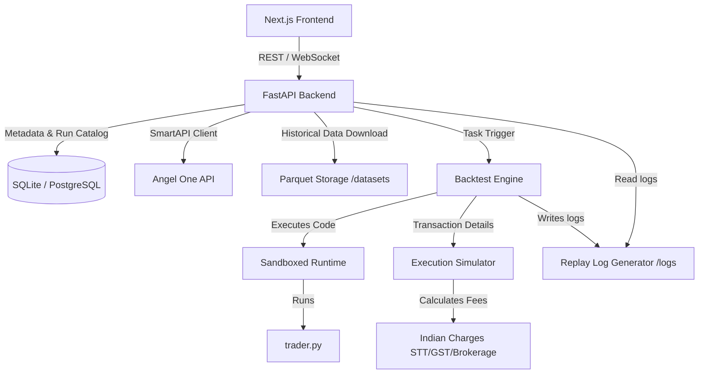

# QuantLab Implementation Plan

QuantLab is a full-stack, professional-grade quantitative trading research, backtesting, replay, and visualization platform designed for Indian markets. It integrates Angel One's **SmartAPI** (with TOTP), manages historical tick/candle data in efficient Parquet formats, runs sandboxed Python strategy scripts (`trader.py`), simulates execution with real Indian market fees, and visualizes backtest replays in a Prosperity-style interface.

---

## User Review Required

> [!IMPORTANT]
> **Authentication & API Access:** To connect with SmartAPI, the user needs an Angel One developer account (API Key, Client Code, Password, and TOTP Secret). We will provide a **high-fidelity Mock Mode** out of the box that generates realistic Indian market candles (gaps, trends, volatility regimes) and token mappings so that the system is fully functional even without live SmartAPI keys.
> Please verify if this fallback design is acceptable.

> [!NOTE]
> **Database & Cache Fallbacks:**
> To ensure zero-config local startup, the backend will default to **SQLite** (acting as PostgreSQL) and an **in-memory dict cache** (acting as Redis) if external PostgreSQL and Redis services are not configured.

---

## Proposed System Architecture

The project is structured as follows:
- `/backend`: FastAPI server handling auth, metadata catalog, strategy storage, backtest jobs, analytics API, and SmartAPI bridge.
- `/engine`: Core Python quantitative modules:
  - `datamodels`: Domain models (Candle, Order, Trade, Position, Portfolio, etc.)
  - `runtime`: Sandboxed execution engine using standard library restrictions to safely execute dynamic code.
  - `execution`: Simulates broker matching, latency, slippage, and Indian taxation (STT, GST, SEBI charges, Stamp Duty, Brokerage).
  - `backtester`: Candle-by-candle loop and state manager.
  - `logger`: Detailed replay logger capturing state at each step.
  - `analytics`: Post-backtest metrics calculation (Sharpe, Sortino, Calmar, drawdowns).
  - `research`: Market regime analysis (trending, ranging, volatile, gap days) and volatility classifiers.
  - `capital`: Capital scaling, minimum capital, and margin utilization analysis.
  - `optimization`: Grid search and Bayesian parameter sweeps.
- `/frontend`: Next.js 15 app with Tailwind CSS, shadcn/ui, Monaco Editor, TradingView Lightweight Charts, and Apache ECharts.
- `/strategies`: User-authored Python strategy scripts.
- `/datasets`: Historical Parquet storage.
- `/logs`: Log files.
- `/tests`: Python unit tests.
- `/docs`: Documentation.
- `/deployment`: Docker Compose / deployment templates.
- `/scripts`: Utility scripts (e.g. bootstrap, data downloaders).



---

## Proposed Changes

### 1. Repository Layout & Configuration

We will organize the folder hierarchy as specified:
- `/frontend`: Next.js frontend with Tailwind and TypeScript.
- `/backend`: FastAPI application.
- `/engine`: Python engine modules.
- `/strategies`: Directory for strategies.
- `/datasets`: Historical Parquet storage.
- `/logs`: Log files.
- `/tests`: Python unit tests.
- `/docs`: Documentation.
- `/deployment`: Docker Compose / deployment templates.
- `/scripts`: Utility scripts (e.g. bootstrap, data downloaders).

---

### 2. Core Python Engine Components

#### [NEW] [datamodels.py](file:///c:/Users/rajy7/quantp/engine/datamodels.py)
Defines the core Pydantic domain models:
- `Candle`: time, open, high, low, close, volume, open_interest.
- `Order`: id, symbol, direction (BUY/SELL), type (LIMIT/MARKET), price, qty, status.
- `Trade`: id, order_id, timestamp, price, qty, direction, value, slippage, brokerage, taxes.
- `Position`: symbol, qty, avg_price, unrealized_pnl, realized_pnl, margin_required.
- `Portfolio`: cash, margin_used, margin_free, equity, positions (dict), total_fees, total_pnl.
- `MarketState`: current_candle, historical_candles (list), portfolio, active_orders (list), position.
- `BacktestRun`: id, strategy_name, symbol, interval, start_time, end_time, initial_capital.
- `ReplayEvent`: step, timestamp, candle, action (orders placed/filled), portfolio_snapshot, message.
- `StrategyResult`: metrics (dict), equity_curve (list), trades (list), regimes (list).

#### [NEW] [runtime.py](file:///c:/Users/rajy7/quantp/engine/runtime.py)
Implements strategy sandboxing. The strategy file `trader.py` will define a class:
```python
class Strategy:
    def __init__(self):
        self.parameters = {}
    def on_bar(self, state: MarketState) -> list[OrderRequest]:
        # User logic
        pass
```
The runtime loads this dynamically in a restricted namespace (e.g., stripping `__builtins__` of imports, blocking `eval`, `exec`, and file operations) and invokes `on_bar`.

#### [NEW] [execution.py](file:///c:/Users/rajy7/quantp/engine/execution.py)
Simulates order execution and Indian taxation:
- **Brokerage**: Flat ₹20 per trade or 0.03% (whichever is lower) for intraday F&O / Equities.
- **STT/CTT**: 0.1% on purchase & sale (Equity Delivery), 0.025% on sale (Equity Intraday), 0.0125% on sale (Futures).
- **Exchange Transaction Charges**: NSE Equity: 0.00343%, NSE Futures: 0.0019%.
- **GST**: 18% of (Brokerage + Exchange Charges).
- **SEBI Charges**: ₹10 per crore (0.0001%).
- **Stamp Duty**: Buy-side only (0.015% Delivery, 0.003% Intraday, 0.002% Futures).
- **Slippage**: Constant, percentage-based, or volume-based slippage modeling.
- **Latency**: Simulation of delayed orders (e.g. execution at next tick or with small delay).

#### [NEW] [backtester.py](file:///c:/Users/rajy7/quantp/engine/backtester.py)
Implements the event-driven backtesting engine. Steps through historical candles:
1. Prepares `MarketState`.
2. Passes to the Strategy `on_bar` method.
3. Retrieves order placements.
4. Feeds orders to `ExecutionSimulator` for matching against current high/low/close.
5. Updates positions, PnL, margin utilization, and records a `ReplayEvent` to the JSON log.

#### [NEW] [analytics.py](file:///c:/Users/rajy7/quantp/engine/analytics.py)
Computes trading statistics:
- CAGR, Sharpe Ratio, Sortino Ratio, Calmar Ratio.
- Max Drawdown (and recovery duration).
- Profit Factor, Win Rate, Expectancy, Capital Efficiency.
- Cost Breakdown (detailed breakdown of brokerage vs STT/taxes).

#### [NEW] [research.py](file:///c:/Users/rajy7/quantp/engine/research.py)
Calculates market indicators and classifies regimes:
- Regimes: Trending Bullish, Trending Bearish, High Volatility Ranging, Low Volatility Ranging, Gap Days.
- Performance attribution: segments strategy trades and metrics by regime.

#### [NEW] [capital.py](file:///c:/Users/rajy7/quantp/engine/capital.py)
Runs multi-pass simulations to find:
- Minimum viable capital (to prevent margin calls / risk of ruin).
- Optimal capital allocation based on margin usage.
- Scaling behavior (diminishing returns due to slippage).

#### [NEW] [optimization.py](file:///c:/Users/rajy7/quantp/engine/optimization.py)
Executes grid search/parameter optimization. Runs backtests in parallel using a Python `ProcessPoolExecutor` and returns a parameter-performance grid.

---

### 3. Backend (FastAPI Web Server)

#### [NEW] [main.py](file:///c:/Users/rajy7/quantp/backend/main.py)
Initializes the FastAPI app with CORS, logging, and error handling. Routes to sub-modules.

#### [NEW] [smartapi.py](file:///c:/Users/rajy7/quantp/backend/smartapi.py)
Manages the Angel One SmartAPI connection:
- Fetch and cache the symbol token file (`OpenAPISymbolTokendata.json`).
- Handles secure TOTP login, caching JWT sessions.
- Downloads historical data (1-min, 5-min, Daily) and stores it in `/datasets/parquet/{symbol}`.
- Mock API Generator: if API credentials are not supplied, provides realistic generated market data for standard NSE symbols (e.g. SBIN, RELIANCE, NIFTY).

#### [NEW] [database.py](file:///c:/Users/rajy7/quantp/backend/database.py)
Sets up SQLAlchemy/SQLModel. Fallbacks automatically to a local SQLite database (`quantlab.db`) if no PostgreSQL URL is configured.
Tables:
- `User`: For local authentication.
- `Strategy`: Metadata and current/historical versions of `trader.py` code.
- `BacktestResult`: Catalog of completed backtests (referencing local log files and JSON summary stats).
- `MarketDataCatalog`: Metadata of downloaded Parquet files.

---

### 4. Frontend (Next.js 15 Client)

We will use Next.js 15 with shadcn/ui and Tailwind CSS.
Key components and pages:
- **`Layout`**: Modern Sidebar with responsive navigation, dark/light theme toggle, and SmartAPI connectivity badge.
- **`Dashboard`**: High-level overview of available datasets, active strategies, past backtests, and system status.
- **`Replay Studio`**: Prosperity-style interface:
  - **TradingView Lightweight Charts** showing the price candles, technical indicators, and markers for BUY/SELL actions.
  - **Playback Speed Controls**: Play/Pause, Step Forward/Backward, scrubbing slider.
  - **Snapshots Panel**: Real-time positions table, order log, equity curve, and a terminal displaying strategy `print` output and decision reasoning.
- **`Strategy IDE`**: Fullscreen Monaco Editor with code autocomplete, syntax highlighting, templates (e.g., EMA crossover, Mean Reversion), and a quick backtest runner.
- **`Research Lab`**: ECharts graphs showing market regimes, correlation matrices, and metrics segmented by regime.
- **`Capital Studio`**: Visualizations of capital scaling, margin usage, and Monte Carlo-style equity path projections.
- **`Optimization Lab`**: Heatmaps of Sharpe ratios for parameters X and Y using Apache ECharts.
- **`Dataset Explorer`**: List downloaded symbols, select dates, request historical downloads from SmartAPI, and preview Parquet dataset schemas.

---

## Verification Plan

### Automated Tests
- Build python test suite under `/tests` checking:
  - Sandboxed runtime safety (should block imports, file access, command execution).
  - Indian brokerage and taxes calculation correctness.
  - Backtester matching engine logic (stop losses, limit orders, market orders).
  - Metrics calculation logic (Sharpe, Calmar, Max Drawdown).
- Commands: `pytest tests/`

### Manual Verification
1. Boot backend: `python -m backend.main`
2. Boot frontend: `npm run dev`
3. Connect with SmartAPI (or choose Mock Mode).
4. Download NIFTY 1-minute historical data for a 7-day range.
5. Create a Strategy (e.g., Simple EMA Crossover) in the Strategy IDE.
6. Run the backtest with standard Zerodha-like fees.
7. Open **Replay Studio**, playback the test, and scrub through candles to verify marker alignment and position changes.
8. Check analytics charts (regimes, parameter sweeps, minimum capital charts).
